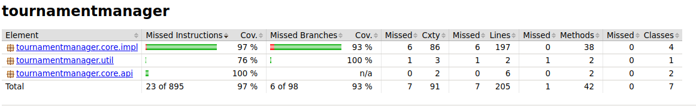
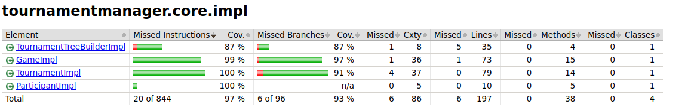
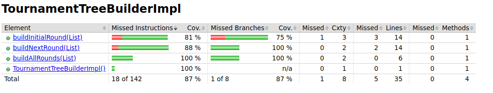
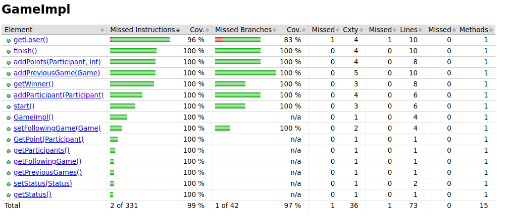
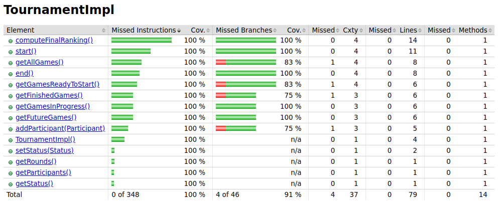
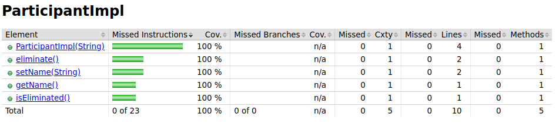

= Rapport de projet

Ce document est un rapport de projet de groupe dans pour le module de test logiciel au sein du master 1 ALMA.

Notre groupe est composé de :
                                - **Valentin Goubon**
                                - **Gabriel Pouplin**
                                - **Alan Provost**

== Analyse de la testabilité :
Au sein de la classe GameImpl, il n'est pas possible d'avoir accès au point d'un joueur. Il s'agit d'un problème d'observabilité
Il faudrait donc ajouter un Getter pour pouvoir ainsi voir les points d'un joueur à un instant donné.
Pour tester la class GameImpl, il faudarit ajouter un setStatus pour améliorer la controlabilité pendant les tests.
La classe TounamentImpl manque d'un Getter pour observer le contenu de participants.

== Méthode fonctionnelle :

=== Test de la méthode start() de la class GameImpl.java

    Domaine d'entrée :
                        - this.status : de type status
                        - this.participants : Liste de participants

    Les différents statuts de notre domaine d'entrée :
    C1A : status.NOTSTARTED         C2A : this.participants.size() = 2
    C1B : status.INPROGRESS         C2B : this.participants.size() = 0||1
    C1C : status.FINISHED

    Ensuite nous appliquons un base choice coverage avec comme base :
    C1A     C2A (Combinaison de base)

    C1B     C2A
    C1C     C2A
    C1A     C2B

    Suite de tests complets pour la méthode :
    Status              this.participants                                 ORACLE
    status.NOTSTARTED   this.participants.size() = 2                      status.INPROGRESS
    status.INPROGRESS   this.participants.size() = 2                      TournamentException
    status.NOTSTARTED   this.participants.size() = 2                      TournamentException
    status.NOTSTARTED   this.participants.size() = 0                      TournamentException

=== Test de la méthode getLoser() de la classe GameImpl.java

    Domaine d'entrée :
                        - this.status : de type status
                        - plist : Liste de participants
                        - scoreP1 : Integer
                        - scoreP2 : Integer

    Les différents statuts de notre domaine d'entrée :
    C1A : status.NOTSTARTED         C2A : plist vide                                C3A : scoreP1 > scoreP2
    C1B : status.INPROGRESS         C2B : plist contenant exactement 1 joueur.      C3B : scoreP1 < scoreP2
    C1C : status.FINISHED           C2C : plist contenant 2 joueurs.                C3C : scoreP1 = scoreP2

    Ensuite nous appliquons un base choice coverage avec comme base :
    C1C     C2C     C3A/

    C1A     C2C     C3A Ne peut pas être testé car si la game est fini elle ne peut pas etre en start
    C1B     C2C     C3A Ne peut pas être testé car si la game est fini elle ne peut pas etre en inProgress
    C1C     C2A     C3A Ne peut pas être testé car la game ne peut pas start avec 0 joueur
    C1C     C2B     C3A Ne peut pas être testé car la game ne peut pas start avec 1 joueur
    C1C     C2C     C3B
    C1C     C2C     C3C Ne peut pas être testé car on ne peut pas finir la game en cas d'égalité
    Suite de tests complets pour la méthode :
    Status              this.participants               score                           ORACLE
    status.FINISHED     this.participants.size()=2      score p1 =10, score p2 = 0      p2
    status.FINISHED     this.participants.size()=2      score p1 =0, score p2 = 10      p1
== Qualité des tests - Couverture du code :

=== Couverture global du code :



=== Couverture détaillée des classes :



==== Couverture du TournamentTreeBuilderImpl :



==== Couverture du GameImpl :



==== Couverture du TournamentFonctionnelle :



==== Couverture du ParticipantImpl :



== Méthode Structurelle :

* Nous avons un premier graphe de flot de contrôle avec la méthode buildAllRounds() de la classe TournamentTreeBuilderImpl.
image::CFG\buildAllRounds().png[]
image::CFG\CFG_buildAllRounds().png[]

* Nous avons un deuxième graphe de flot de contrôle avec la méthode computeFinalRanking() de la classe TournamentImpl.
image::CFG\computeFinalRanking().png[]
image::CFG\CFG_computeFinalRanking().png[]

== Qualité des tests - Couverture du code (bis) :


== Qualité des tests - analyse de mutation :

== Elimination des mutants


== Qualité des tests - analyse de mutation (bis) :


== Synthèse finale :

    * Problèmes identifiés :
        Dans la class GameImpl, la méthode addParticipant ne répond pas à tous les critères de la spécification. En effet, lorsqu'on ajoute un participant déjà présent dans la game on devrait renvoyer une TournamentException or ici on ne remonte aucune information. Ce défaut a été corrigé en ajoutant la conditionnelle suivante : this.participants.containsKey(participant)

    * Détection d'un bug dans la classe TournamentTreeBuilderImpl. Lors de la construction de l'arbre il était impossible de construire un deuxième niveau car la liste des games étaient effacés avant de construire l'étage suivant. La correction appliquée est la suivant :
    ```java
        while (!nextRound.isEmpty()) {
            rounds.add(nextRound);
            //nextRound.clear();
            nextRound=buildNextRound(nextRound);
        }
    ```
