= Rapport de projet

Ce document est un rapport de projet de groupe dans pour le module de test logiciel au sein du master 1 ALMA.

Notre groupe est composé de :
                                - **Valentin Goubon**
                                - **Gabriel Pouplin**
                                - **Alan Provost**

== Analyse de la testabilité :
Au sein de la classe GameImpl, il n'est pas possible d'avoir accès au point d'un joueur. Il s'agit d'un problème d'observabilité
Il faudrait donc ajouter un Getter pour pouvoir ainsi voir les points d'un joueur à un instant donné.
Pour tester la class GameImpl, il faudarit ajouter un setStatus pour améliorer la controlabilité pendant les tests.
La classe TounamentImpl manque d'un Getter pour observer le contenu de participants.

== Méthode fonctionnelle :

=== Test de la méthode start() de la class GameImpl.java

    Domaine d'entrée :
                        - this.status : de type status
                        - this.participants : Liste de participants

    Les différents statuts de notre domaine d'entrée :
    C1A : status.NOTSTARTED         C2A : this.participants.size() = 2
    C1B : status.INPROGRESS         C2B : this.participants.size() = 0||1
    C1C : status.FINISHED

    Ensuite nous appliquons un base choice coverage avec comme base :
    C1A     C2A (Combinaison de base)

    C1B     C2A
    C1C     C2A
    C1A     C2B

    Suite de tests complets pour la méthode :
    Status              this.participants                                 ORACLE
    status.NOTSTARTED   this.participants.size() = 2                      status.INPROGRESS
    status.INPROGRESS   this.participants.size() = 2                      TournamentException
    status.NOTSTARTED   this.participants.size() = 2                      TournamentException
    status.NOTSTARTED   this.participants.size() = 0                      TournamentException

=== Test de la méthode getLoser() de la classe GameImpl.java

    Domaine d'entrée :
                        - this.status : de type status
                        - plist : Liste de participants
                        - scoreP1 : Integer
                        - scoreP2 : Integer

    Les différents statuts de notre domaine d'entrée :
    C1A : status.NOTSTARTED         C2A : plist vide                                C3A : scoreP1 > scoreP2
    C1B : status.INPROGRESS         C2B : plist contenant exactement 1 joueur.      C3B : scoreP1 < scoreP2
    C1C : status.FINISHED           C2C : plist contenant 2 joueurs.                C3C : scoreP1 = scoreP2

    Ensuite nous appliquons un base choice coverage avec comme base :
    C1C     C2C     C3A (Combinaison de base)

    C1A     C2C     C3A Ne peut pas être testé car si la game est fini elle ne peut pas être en start.
    C1B     C2C     C3A Ne peut pas être testé car si la game est fini elle ne peut pas être en inProgress.
    C1C     C2A     C3A Ne peut pas être testé car la game ne peut pas start avec 0 joueur.
    C1C     C2B     C3A Ne peut pas être testé car la game ne peut pas start avec 1 joueur.
    C1C     C2C     C3B
    C1C     C2C     C3C Ne peut pas être testé car on ne peut pas finir la game en cas d'égalité

    Suite de tests complets pour la méthode :
    Status              this.participants               score                           ORACLE
    status.FINISHED     this.participants.size()=2      score p1 =10, score p2 = 0      p2
    status.FINISHED     this.participants.size()=2      score p1 =0, score p2 = 10      p1

== Qualité des tests - Couverture du code :

=== Couverture global du code :


=== Couverture détaillée des classes :


==== Couverture du TournamentTreeBuilderImpl :


==== Couverture du GameImpl :


==== Couverture du TournamentImpl :


==== Couverture du ParticipantImpl :


Certaines zones du code ne sont pas couvertes. Cela peut s'expliquer car peut être que ces zone ne peuvent être couverte si on se cantonne à la simple spécification. Il faut pour celà utiliser la méthode structurelle pour explorer toute les branches du code de ce projet.

== Méthode Structurelle :
Les choix des méthodes ont été fait en fonction de celles qui avaient le pourcentage de couverture des branches la moins élevée de toutes.

* Nous avons un premier graphe de flot de contrôle avec la méthode _buildInitialRounds(List)_ de la classe TournamentTreeBuilderImpl.

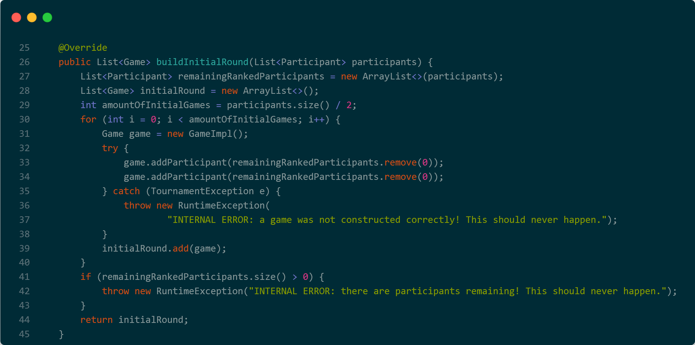

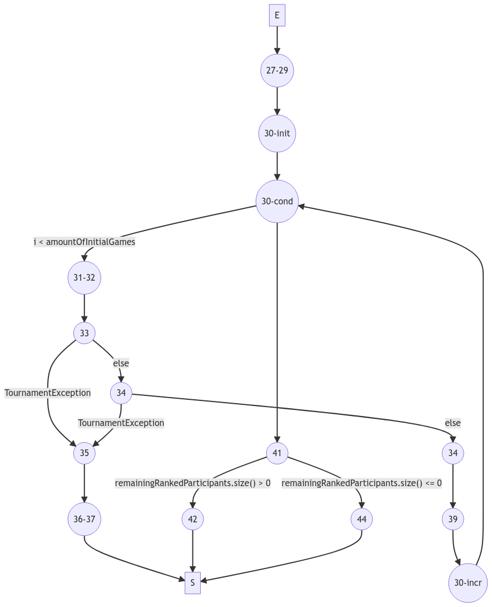

    Jusqu'ici, nous avons tenté de faire une couverture tout chemin afin d'avoir le plus de cas possible à tester.
    Malheureusement, même si cette méthode de couverture est très efficace, elle l'est beaucoup moins lorsque nous avons des boucles for ou while.
    En effet, s'il y a _n_ boucles effectués, il y aura alors minimum entre 1 et n différentes combinaisons possibles rien qu'avec cette boucle.
    Par conséquent, il est judicieux de faire une couverture après un certain nombre de boucles effectués, afin de se rapprocher d'une meilleure couverture.
    C'est ici le cas avec notre fonction _buildInitialRound()_.

    De plus, nous avons une difficulté supplémentaire ici, nous avons deux mêmes exceptions possibles à suivre (l33 et l34).
    Par conséquent, savoir laquelle des deux déclenche une exception, si elle est enclenchée, devient une tâche plus ardue.

    Afin de vérifier si la spécification est bien respectée, nous allons donc devoir réaliser les scénarios de tests suivants :


* Nous avons un deuxième graphe de flot de contrôle avec la méthode _getFinishedGames()_ de la classe TournamentImpl.

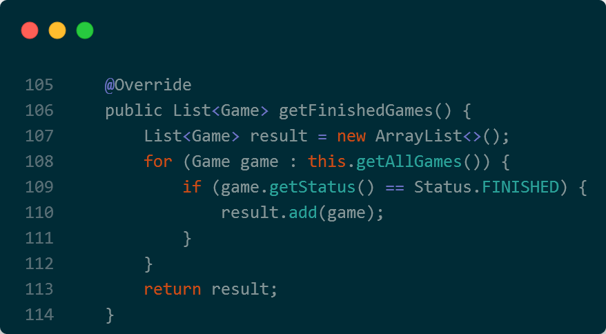

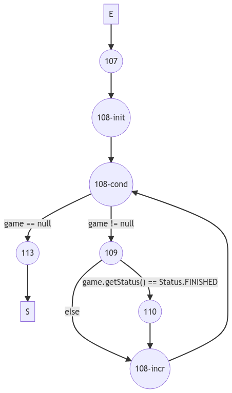

== Qualité des tests - Couverture du code (bis) :

=== Couverture global du code :

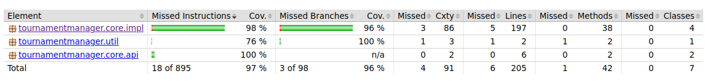

=== Couverture détaillée des classes :

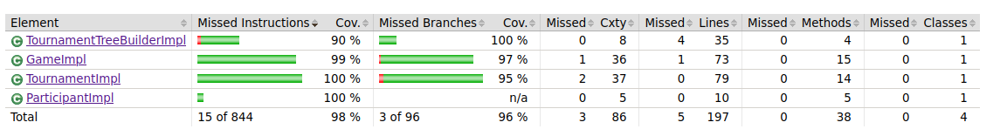

==== Couverture du TournamentTreeBuilderImpl :

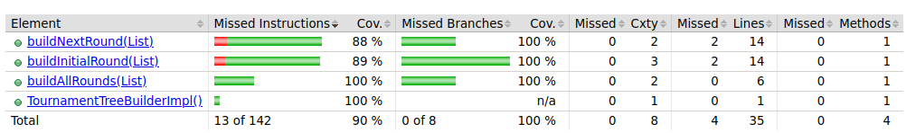
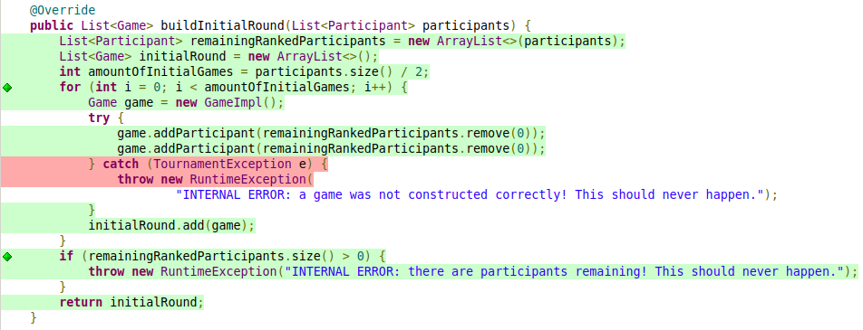
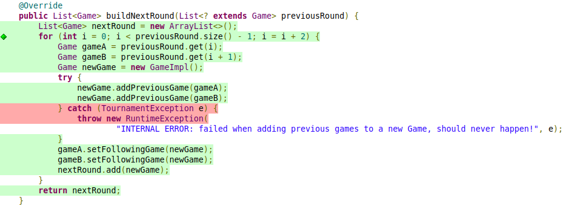

==== Couverture du GameImpl :

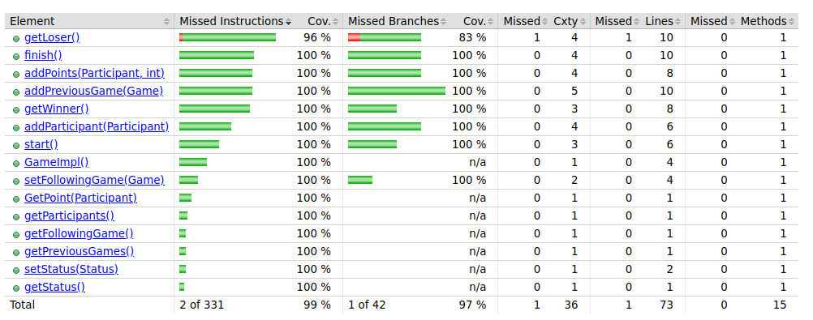
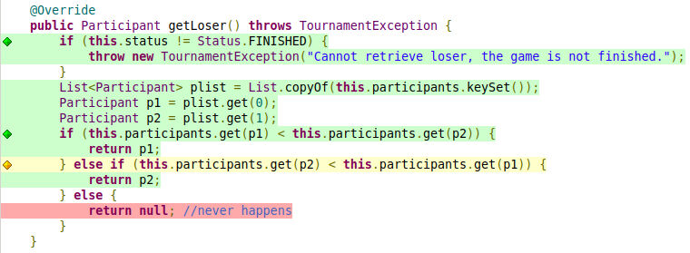

==== Couverture du TournamentImpl :

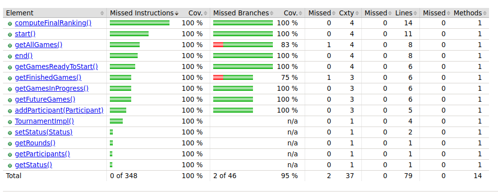
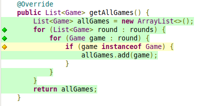
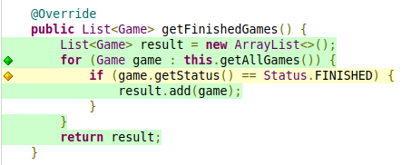

==== Couverture du ParticipantImpl :

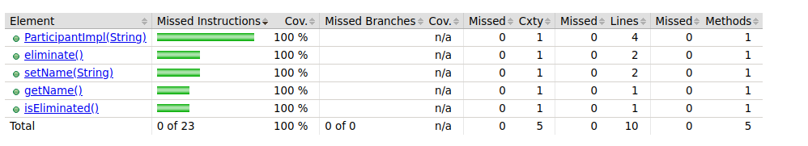

On peut expliquer les branches non couvertes par la présence de zone dans le code tout simplement inatteignable et ce peu importe la méthode de test.

== Qualité des tests - analyse de mutation :

=== Analyse de mutation globale du code :

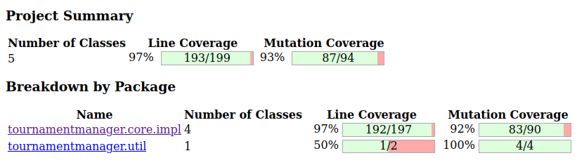

=== Analyse de mutation détaillée des classes :

image::MutationFolder/MutationClassDetailleeAvant.png[]

==== Mutation du TournamentTreeBuilderImpl :

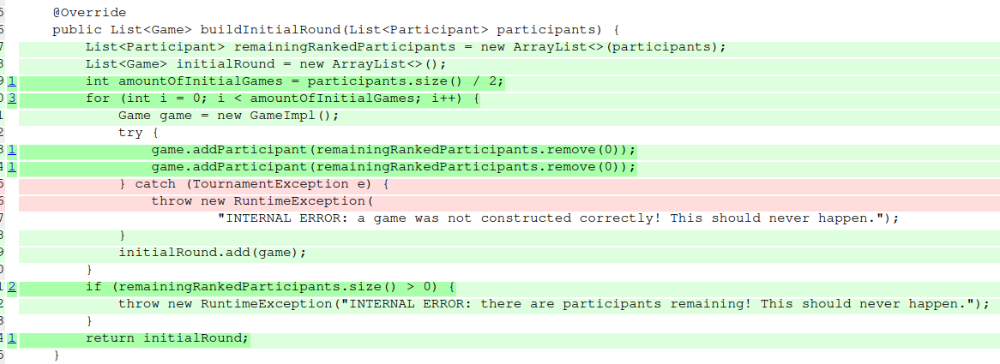
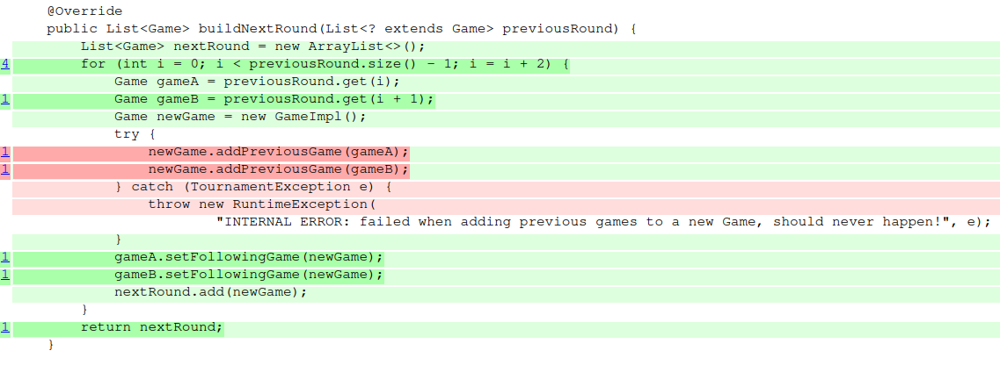
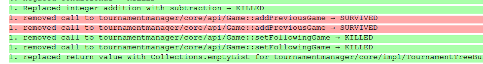

==== Mutation du GameImpl :

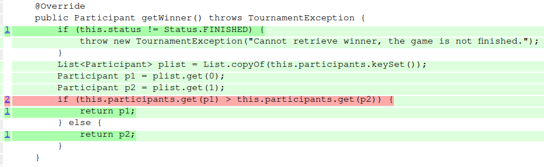
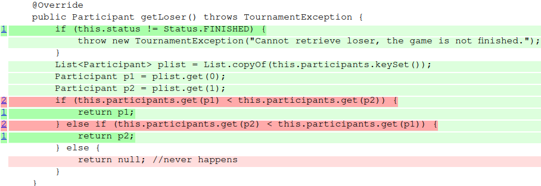
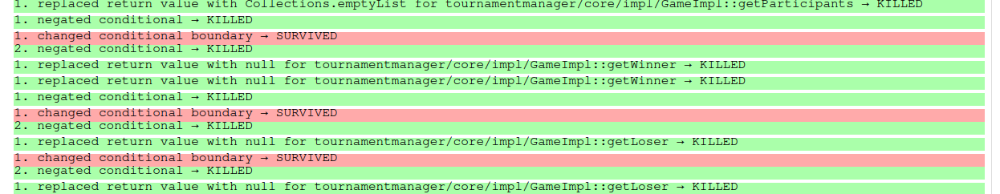

==== Mutation du TournamentImpl :

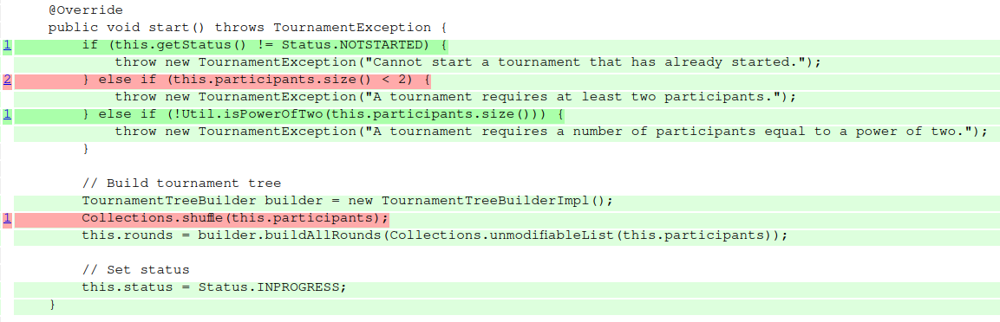
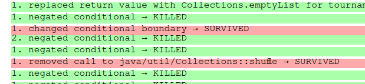

==== Mutation du ParticipantImpl :

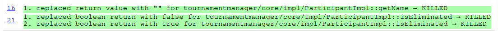

== Elimination des mutants


== Qualité des tests - analyse de mutation (bis) :


== Synthèse finale :

    * Problèmes identifiés :
        Dans la class GameImpl, la méthode addParticipant ne répond pas à tous les critères de la spécification. En effet, lorsqu'on ajoute un participant déjà présent dans la game on devrait renvoyer une TournamentException or ici on ne remonte aucune information. Ce défaut a été corrigé en ajoutant la conditionnelle suivante : this.participants.containsKey(participant)

    * Détection d'un bug dans la classe TournamentTreeBuilderImpl. Lors de la construction de l'arbre il était impossible de construire un deuxième niveau car la liste des games étaient effacés avant de construire l'étage suivant. La correction appliquée est la suivant :

    ```java
        while (!nextRound.isEmpty()) {
            rounds.add(nextRound);
            //nextRound.clear();
            nextRound=buildNextRound(nextRound);
        }
    ```
